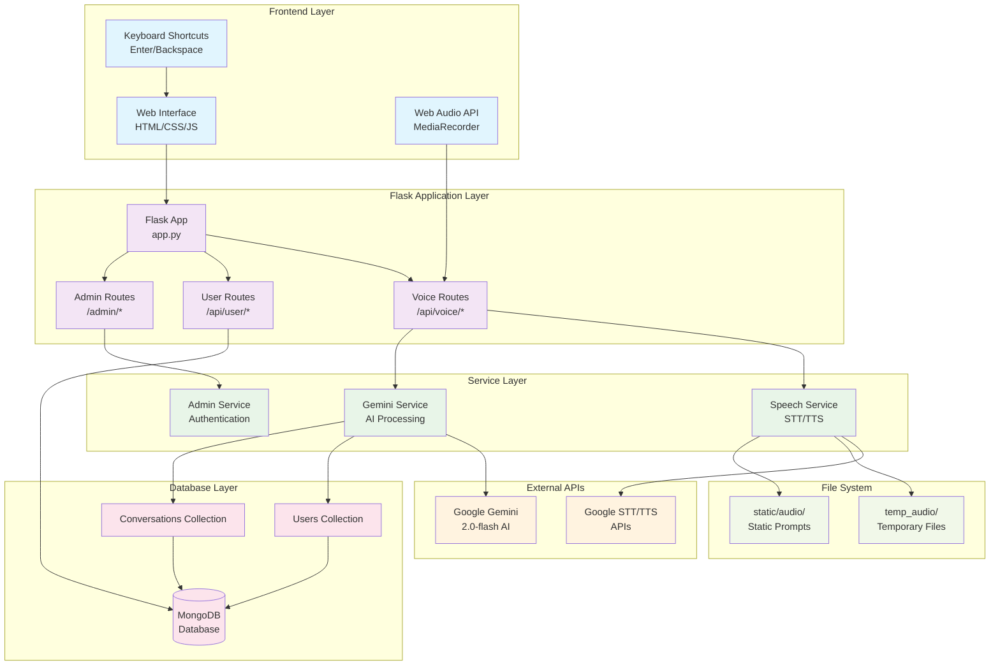
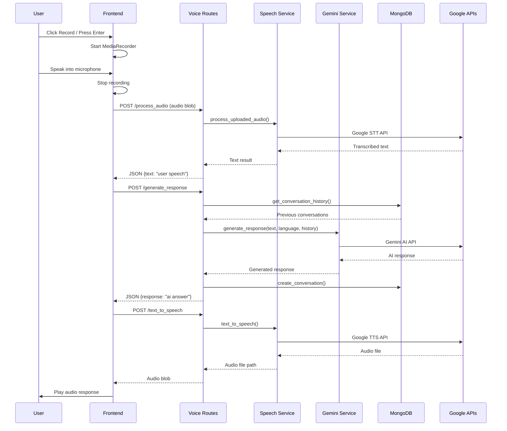
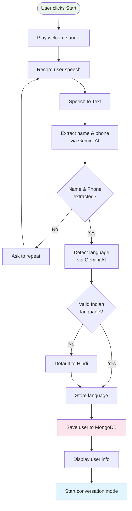
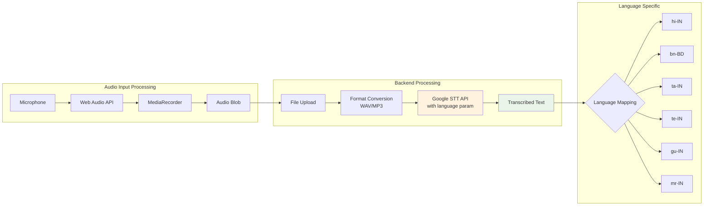
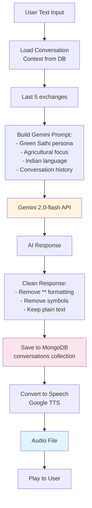
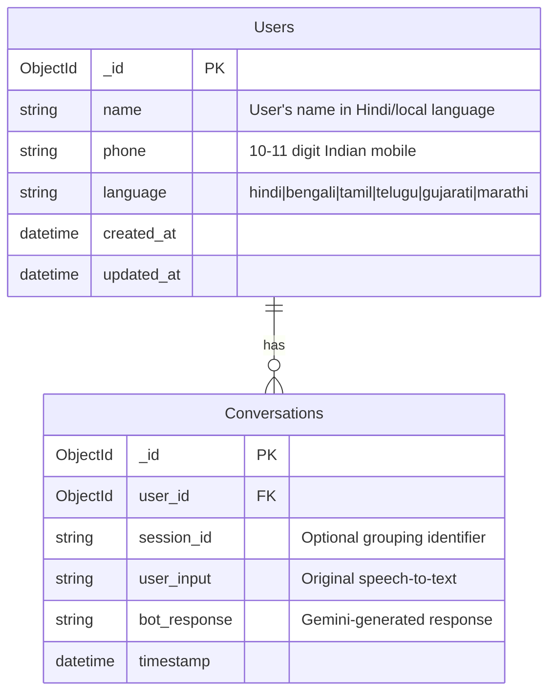
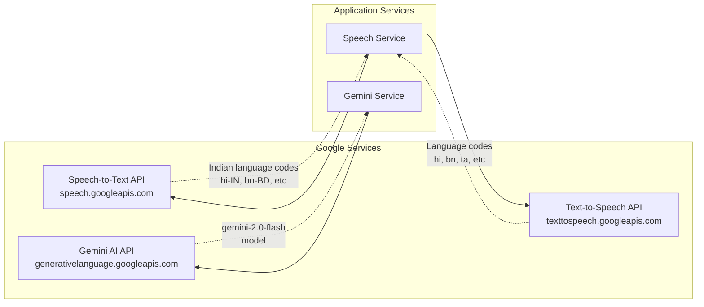
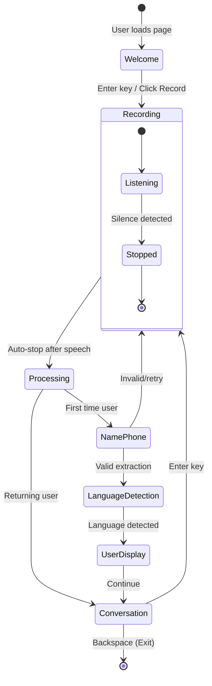

# Green Sathi Voice Bot - Complete Architecture Documentation

## 🏗️ High-Level System Architecture



## 🌊 Core Data Flow

### User Voice Input → AI Response Flow



## 🔄 Micro-Level Component Flows

### 1. User Registration Flow



### 2. Voice Processing Pipeline



### 3. AI Response Generation Flow



## 🎯 Key Code Patterns and Logic

### 1. Service Initialization Pattern

```python
# Services are instantiated as singletons in service files
# backend/services/speech_service.py
class SpeechService:
    def __init__(self):
        self.recognizer = sr.Recognizer()
        # ... initialization logic

# Global singleton instance
speech_service = SpeechService()

# Used in routes via import
from backend.services.speech_service import speech_service
```

### 2. Language Mapping Pattern

```python
# backend/utils/config.py
class Config:
    # TTS/Display languages
    SUPPORTED_LANGUAGES = {
        'hindi': 'hi',
        'bengali': 'bn',
        'tamil': 'ta',
        'telugu': 'te',
        'gujarati': 'gu',
        'marathi': 'mr'
    }
    
    # STT languages (different codes)
    SPEECH_RECOGNITION_LANGUAGES = {
        'hindi': 'hi-IN',
        'bengali': 'bn-BD',
        'tamil': 'ta-IN',
        'telugu': 'te-IN',
        'gujarati': 'gu-IN',
        'marathi': 'mr-IN'
    }
```

### 3. Audio File Management Pattern

```python
# Temporary files for user interactions
temp_filename = f"tts_{hashlib.md5(text.encode()).hexdigest()}_{language}.mp3"
temp_path = os.path.join('temp_audio', temp_filename)

# Static files for system prompts
static_filename = f"static_{prompt_type}_{language}.mp3"
static_path = os.path.join('static', 'audio', static_filename)

# Always clean up temp files
try:
    # ... use file
finally:
    if os.path.exists(temp_path):
        os.remove(temp_path)
```

### 4. Gemini AI Integration Pattern

```python
def extract_name_phone(self, text):
    prompt = f"""
Extract the name and phone number from the following Hindi/Indian text. 
The text may have spaces or gaps in the phone number due to speech recognition.
Return the result in JSON format with keys 'name' and 'phone'.

Text: "{text}"

Important Guidelines:
- Phone numbers should be 10-11 digits total (remove spaces/gaps)
- Indian mobile numbers start with 6, 7, 8, or 9
- Join separated digits to form complete number
...
    """
    
    response = self.model.generate_content(prompt)
    
    # Parse JSON with fallback
    try:
        response_text = response.text.strip()
        if '```json' in response_text:
            response_text = response_text.split('```json')[1].split('```')[0].strip()
        result = json.loads(response_text)
        return {
            'name': result.get('name'),
            'phone': self._clean_phone_number(result.get('phone'))
        }
    except json.JSONDecodeError:
        return self._extract_name_phone_fallback(text)
```

### 5. Frontend State Management Pattern

```javascript
class VoiceBotApp {
    constructor() {
        this.currentStep = 'welcome'; // State machine
        this.userInfo = {
            user_id: null,
            session_id: null,
            name: null,
            phone: null,
            language: null
        };
    }
    
    async handleTranscribedText(text) {
        switch (this.currentStep) {
            case 'name_phone':
                await this.extractUserInfo(text);
                break;
            case 'language_detection':
                await this.detectLanguage(text);
                break;
            case 'conversation':
                await this.processConversation(text);
                break;
        }
    }
}
```

### 6. MongoDB ObjectId Conversion Pattern

```python
def convert_objectids_to_strings(obj):
    """Recursively convert ObjectIds to strings for JSON serialization"""
    if isinstance(obj, dict):
        return {key: convert_objectids_to_strings(value) for key, value in obj.items()}
    elif isinstance(obj, list):
        return [convert_objectids_to_strings(item) for item in obj]
    elif isinstance(obj, ObjectId):
        return str(obj)
    elif isinstance(obj, datetime):
        return obj.strftime('%Y-%m-%d %H:%M:%S')
    else:
        return obj
```

## 🗄️ Database Schema & Relationships



### Sample Data Patterns

```javascript
// User Document
{
  "_id": ObjectId("..."),
  "name": "राम शर्मा",
  "phone": "9876543210",
  "language": "hindi",
  "created_at": ISODate("2025-09-30T10:30:00Z"),
  "updated_at": ISODate("2025-09-30T10:30:00Z")
}

// Conversation Document
{
  "_id": ObjectId("..."),
  "user_id": ObjectId("..."),
  "session_id": "session_uuid_123",
  "user_input": "मेरी फसल में कीड़े लग रहे हैं",
  "bot_response": "आपकी फसल में कीड़ों की समस्या के लिए नीम का तेल...",
  "timestamp": ISODate("2025-09-30T10:35:00Z")
}
```

## 🚀 Development Workflows

### Essential Setup Commands (Windows PowerShell)

```powershell
# 1. Environment activation (CRITICAL!)
venv\Scripts\activate

# 2. Install dependencies
pip install flask flask-cors pymongo python-dotenv google-generativeai speechrecognition gtts pydub requests

# 3. Environment configuration
cp .env.example .env
# Edit .env with GEMINI_API_KEY, MONGODB_URL, SECRET_KEY

# 4. MongoDB startup
# Ensure MongoDB service is running on localhost:27017

# 5. Initial setup and static audio generation
python setup.py

# 6. Create test data and validate setup
python tests/quick_test.py

# 7. Start application
python app.py
```

### Testing & Validation Workflow

```powershell
# Comprehensive testing pipeline
python tests/quick_test.py                    # DB connectivity + sample data
python tests/test_admin_apis.py              # Admin endpoint validation  
python tests/admin_fixes_validation.py       # ObjectId conversion tests
python tests/run_tests.py                    # Full test suite

# Manual testing endpoints
# Access http://localhost:5000 for main app
# Access http://localhost:5000/admin (admin/123456) for admin panel
```

## 🔧 Integration Points & External Dependencies

### Google API Integrations



### File System Architecture

```plaintext
Green-Sathi-Voice/
├── temp_audio/                 # Temporary TTS files (auto-cleanup)
│   ├── tts_hash1_hindi.mp3    # User response audio
│   └── tts_hash2_bengali.mp3  # Conversation audio
├── static/audio/               # Static system prompts
│   ├── static_welcome_hindi.mp3
│   ├── static_name_phone_bengali.mp3
│   └── static_language_selection_tamil.mp3
├── backend/
│   ├── models/database.py      # MongoDB connection & operations
│   ├── services/
│   │   ├── speech_service.py   # STT/TTS processing
│   │   ├── gemini_service.py   # AI integration
│   │   └── admin_service.py    # Authentication
│   ├── routes/                 # Flask blueprints
│   │   ├── voice_routes.py     # /api/voice/* endpoints
│   │   ├── user_routes.py      # /api/user/* endpoints
│   │   └── admin_routes.py     # /admin/* endpoints
│   └── utils/config.py         # Centralized configuration
└── static/js/app.js           # Frontend state machine
```

## 🎮 User Interaction Patterns

### Keyboard Shortcuts & Controls



### Mobile WebView Optimizations

- **Audio Permissions**: Automatic microphone permission requests
- **Touch Controls**: Large button targets for mobile interaction
- **Audio Playback**: Cross-platform audio player compatibility
- **CORS Support**: Enabled for mobile app integrations
- **File Upload**: Handles audio blob uploads efficiently (max 16MB)

## 📊 Performance & Monitoring

### Admin Dashboard Capabilities

```mermaid
graph TB
    subgraph "Admin Analytics"
        STATS[User Statistics]
        CONV[Conversation Analytics]
        LANG[Language Distribution]
        DAILY[Daily Usage Trends]
    end
    
    subgraph "Data Sources"
        USERS[(Users Collection)]
        CONVERSATIONS[(Conversations Collection)]
    end
    
    subgraph "Aggregation Queries"
        TOTAL[Total Users Count]
        RECENT[Recent Users (7 days)]
        WEEKLY[Weekly Signup Trends]
        AVG[Avg Conversations/User]
    end
    
    USERS --> TOTAL
    USERS --> RECENT
    USERS --> WEEKLY
    USERS --> LANG
    
    CONVERSATIONS --> AVG
    CONVERSATIONS --> DAILY
    CONVERSATIONS --> CONV
    
    TOTAL --> STATS
    RECENT --> STATS
    WEEKLY --> STATS
    LANG --> STATS
    AVG --> CONV
    DAILY --> CONV
```

### Production Deployment Pattern

```yaml
# Deployment Configuration
Runtime: Python 3.8+
Server: gunicorn app:app
Dependencies: requirements.txt (pinned versions)
Environment Variables:
  - GEMINI_API_KEY (required)
  - MONGODB_URL (required) 
  - SECRET_KEY (required, strong)
  - DEBUG=False (production)
  - HOST=0.0.0.0
  - PORT=5000
```

## 🔍 Debugging & Troubleshooting

### Common Issues & Solutions

| Issue | Cause | Solution |
|-------|-------|----------|
| Import Errors | Virtual environment not activated | `venv\Scripts\activate` |
| MongoDB Connection Failed | Service not running | Check `mongodb://localhost:27017` |
| Gemini API Errors | Invalid/missing API key | Verify `GEMINI_API_KEY` in `.env` |
| Audio Processing Fails | Browser permissions | Enable microphone access |
| ObjectId JSON Errors | Missing conversion | Use `convert_objectids_to_strings()` |
| Static Audio Missing | Setup not run | Execute `python setup.py` |

### Logging Patterns

```python
import logging
logger = logging.getLogger(__name__)

# Service operations
logger.info(f"Speech recognized: {text}")
logger.warning("Could not understand the audio")  
logger.error(f"Speech recognition service error: {e}")

# Database operations  
logger.info("Connected to MongoDB successfully")
logger.error(f"Failed to create user: {e}")

# API interactions
logger.error(f"Failed to generate response using Gemini AI: {e}")
```

This architecture documentation provides the complete technical blueprint for understanding, maintaining, and extending the Green Sathi Voice Bot system. The multilingual AI-powered voice assistant demonstrates modern web application patterns with Flask, MongoDB, and Google AI services integration.
