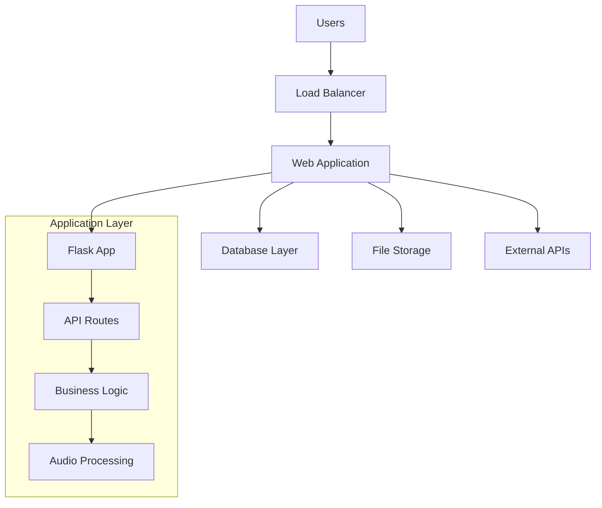

# Flask Web Application Deployment
## Scope of Work Document

---

### Document Information
| Field | Details |
|-------|---------|
| **Project Type** | Flask Web Application Deployment |
| **Document Version** | 1.0 |
| **Date** | October 22, 2025 |

---

## 1. Project Overview

### 1.1 Objective
Deploy a production-ready Flask-based web application with real-time audio processing capabilities, database integration, and responsive user interface.

### 1.2 Application Architecture
```
┌─────────────────┐    ┌─────────────────┐    ┌─────────────────┐
│   Frontend      │    │   Backend       │    │   Database      │
│   (HTML/JS)     │◄──►│   (Flask)       │◄──►│   (MongoDB)     │
│                 │    │                 │    │                 │
│ • Responsive UI │    │ • REST APIs     │    │ • User Data     │
│ • Audio Input   │    │ • Audio Proc.   │    │ • Sessions      │
│ • Real-time UX  │    │ • AI Integration│    │ • Logs          │
└─────────────────┘    └─────────────────┘    └─────────────────┘
```

### 1.3 Technology Stack
- **Backend Framework**: Flask (Python)
- **Database**: MongoDB
- **Frontend**: HTML5, JavaScript, CSS3
- **External Services**: AI APIs, Speech Processing
- **Deployment**: Docker-ready application

---

## 2. Infrastructure Requirements

### 2.1 Server Specifications
| Component | Minimum | Recommended |
|-----------|---------|-------------|
| **CPU** | 2 vCPUs | 4 vCPUs |
| **RAM** | 4 GB | 8 GB |
| **Storage** | 50 GB SSD | 100 GB SSD |
| **Network** | 100 Mbps | 1 Gbps |
| **OS** | Ubuntu 20.04+ | Ubuntu 22.04 LTS |

### 2.2 Network Requirements
```
Internet ◄────► Load Balancer ◄────► Web Server ◄────► Database
    │                                      │              │
    │                                      ▼              │
    └─────────► External APIs         File Storage        │
                                           │              │
                                           ▼              ▼
                                    Audio Processing   MongoDB
                                                      Cluster
```

### 2.3 External Dependencies
- MongoDB Database (Local or Cloud)
- External AI Service APIs
- Speech Processing Services
- SSL Certificate Authority
- Domain Name Service (DNS)

---

## 3. Deployment Architecture

### 3.1 System Components


### 3.2 Multi-Environment Deployment Pipeline

#### 3.2.1 Environment Strategy
The application follows a structured three-tier deployment approach to ensure quality, stability, and minimal production risks:

```
┌─────────────────┐    ┌─────────────────┐    ┌─────────────────┐
│   Development   │───►│       UAT       │───►│   Production    │
│   Environment   │    │   Environment   │    │   Environment   │
│                 │    │                 │    │                 │
│ • feature/*     │    │ • develop       │    │ • main/master   │
│ • Local Testing │    │ • Staging Tests │    │ • Live Users    │
│ • Rapid Deploy  │    │ • User Testing  │    │ • Full Security │
└─────────────────┘    └─────────────────┘    └─────────────────┘
```

#### 3.2.2 Git Branch Strategy
```
main/master (Production)
    ├── develop (UAT/Staging)
    │   ├── feature/user-management
    │   ├── feature/audio-processing
    │   └── feature/api-enhancement
    └── hotfix/critical-bug-fix
```

#### 3.2.3 Environment Specifications

| Environment | Purpose | Git Branch | Auto-Deploy | Testing Level |
|-------------|---------|------------|-------------|---------------|
| **Development** | Active development | `feature/*` | Yes | Unit Tests |
| **UAT/Staging** | User acceptance testing | `develop` | Yes | Integration Tests |
| **Production** | Live application | `main` | Manual | Full Test Suite |

#### 3.2.4 Deployment Workflow
```
Developer Push ──┐
                 ├── Feature Branch ──► Dev Environment
                 │                      │
                 │                      ▼
                 │                   Run Tests ──┐
                 │                               ├── Pass ──► Merge to Develop
                 │                               └── Fail ──► Fix & Retry
                 │
                 └── Develop Branch ──► UAT Environment
                                        │
                                        ▼
                                    UAT Testing ──┐
                                                  ├── Pass ──► Production Deploy
                                                  └── Fail ──► Back to Development
```

#### 3.2.5 Environment Configuration

**Development Environment:**
- Server: 1 vCPU, 2GB RAM, 25GB Storage
- Database: MongoDB (shared development instance)
- Domain: `dev-app.company.com`
- SSL: Self-signed certificate
- Monitoring: Basic logging only

**UAT Environment:**
- Server: 2 vCPU, 4GB RAM, 50GB Storage  
- Database: MongoDB (dedicated staging instance)
- Domain: `uat-app.company.com`
- SSL: Valid certificate
- Monitoring: Full monitoring with alerts

**Production Environment:**
- Server: 4 vCPU, 8GB RAM, 100GB Storage
- Database: MongoDB (clustered with replication)
- Domain: `app.company.com`
- SSL: Premium certificate with auto-renewal
- Monitoring: 24/7 monitoring with alerting

#### 3.2.6 Automated CI/CD Pipeline

```yaml
# Sample Pipeline Stages
stages:
  - build
  - test
  - deploy-dev
  - deploy-uat
  - deploy-prod

triggers:
  - feature/* → Development
  - develop → UAT
  - main → Production (manual approval)
```

---

## 4. Deployment Phases

### 4.1 Phase 1: Development Environment Setup 
- [ ] Development server provisioning and OS installation
- [ ] Git repository setup with branch strategy
- [ ] Development database configuration
- [ ] CI/CD pipeline basic setup
- [ ] Development domain and basic SSL setup

### 4.2 Phase 2: UAT Environment Setup
- [ ] UAT server provisioning and configuration
- [ ] UAT database setup with data migration tools
- [ ] Automated deployment pipeline for UAT
- [ ] UAT domain and SSL certificate setup
- [ ] Integration testing environment setup

### 4.3 Phase 3: Production Environment Setup 
- [ ] Production server provisioning with high availability
- [ ] Production database cluster setup with replication
- [ ] Production SSL certificates and domain configuration
- [ ] Full monitoring and alerting system setup
- [ ] Backup and disaster recovery procedures

### 4.4 Phase 4: Application Deployment Pipeline 
- [ ] Development environment application deployment
- [ ] UAT environment automated deployment setup
- [ ] Production deployment procedures and manual approval process
- [ ] Environment-specific configuration management
- [ ] Database migration and rollback procedures

### 4.5 Phase 5: Testing & Quality Assurance 
- [ ] Development environment functional testing
- [ ] UAT environment user acceptance testing
- [ ] Production environment smoke testing
- [ ] Performance testing across all environments
- [ ] Security testing and penetration testing

### 4.6 Phase 6: Go-Live & Monitoring 
- [ ] Final production deployment with approval
- [ ] 24/7 monitoring and alerting activation
- [ ] Documentation handover and training
- [ ] Post-deployment support procedures
- [ ] Environment health checks and validation

---

## 5. Technical Implementation

### 5.1 Server Configuration
```bash
# System Dependencies
- Python 3.10.0
- MongoDB 5.0+
- Nginx (reverse proxy)
```

### 5.2 Application Structure
```
/app
├── backend/
│   ├── models/          # Database models
│   ├── routes/          # API endpoints
│   ├── services/        # Business logic
│   └── utils/           # Utilities
├── static/
│   ├── css/            # Stylesheets
│   ├── js/             # Frontend logic
│   └── audio/          # Audio assets
├── templates/          # HTML templates
└── temp_audio/         # Temporary files
```

### 5.3 Security Configuration
- SSL/TLS encryption (HTTPS)
- API rate limiting
- Input validation and sanitization
- Environment variable management
- Database connection security
- File upload restrictions

---

## 6. Operational Requirements

### 6.1 Monitoring & Logging
```
┌─────────────┐    ┌─────────────┐    ┌─────────────┐
│ Application │───►│   Logging   │───►│  Analytics  │
│   Metrics   │    │   System    │    │  Dashboard  │
└─────────────┘    └─────────────┘    └─────────────┘
       │                    │                  │
       ▼                    ▼                  ▼
   CPU/Memory          Error Tracking    Performance
   Disk/Network        Access Logs       Insights
```

### 6.2 Backup Strategy
- **Database**: Daily automated backups with 30-day retention
- **Application Files**: Weekly backups with version control
- **User Data**: Real-time replication with point-in-time recovery
- **Configuration**: Version-controlled configuration management

### 6.3 Maintenance Windows
- **Routine Maintenance**: Sunday 2:00-4:00 AM
- **Emergency Patches**: As required with 2-hour notice
- **Major Updates**: Scheduled monthly with 1-week notice

---

## 7. Performance & Scalability

### 7.1 Performance Targets
| Metric | Target | Measurement |
|--------|--------|-------------|
| **Response Time** | < 2 seconds | 95th percentile |
| **Availability** | 99.5% | Monthly uptime |
| **Concurrent Users** | 500+ | Simultaneous sessions |
| **File Processing** | < 5 seconds | Audio processing |

### 7.2 Scaling Strategy
```
Load Increase ──┐
                ├── Horizontal Scaling (Add Servers)
                ├── Vertical Scaling (Upgrade Hardware)
                ├── Database Sharding
                └── CDN Implementation
```

---

## 8. Deliverables

### 8.1 Technical Deliverables
- [ ] Fully deployed and configured application
- [ ] Database setup with sample data
- [ ] SSL certificates and domain configuration
- [ ] Monitoring and alerting systems
- [ ] Backup and recovery procedures

### 8.2 Documentation Deliverables
- [ ] System architecture documentation
- [ ] Installation and configuration guide
- [ ] User management procedures
- [ ] Troubleshooting guide
- [ ] Maintenance procedures

### 8.3 Training Deliverables
- [ ] Administrator training sessions
- [ ] System operation procedures
- [ ] Emergency response procedures
- [ ] Knowledge transfer sessions

---

## 9. Success Criteria

### 9.1 Technical Success Metrics
- ✅ Application loads within 2 seconds
- ✅ 99.5% uptime achieved
- ✅ All security tests passed
- ✅ Database performance optimized
- ✅ Backup and recovery tested

### 9.2 Business Success Metrics
- ✅ Zero critical bugs in production
- ✅ Monitoring and alerting functional
- ✅ Documentation complete and approved
- ✅ Team trained on system operations
- ✅ Client acceptance and sign-off


---

*This scope of work document outlines the complete deployment strategy for the Flask web application. All technical specifications and timelines are subject to final approval and may be adjusted based on specific requirements and constraints.*