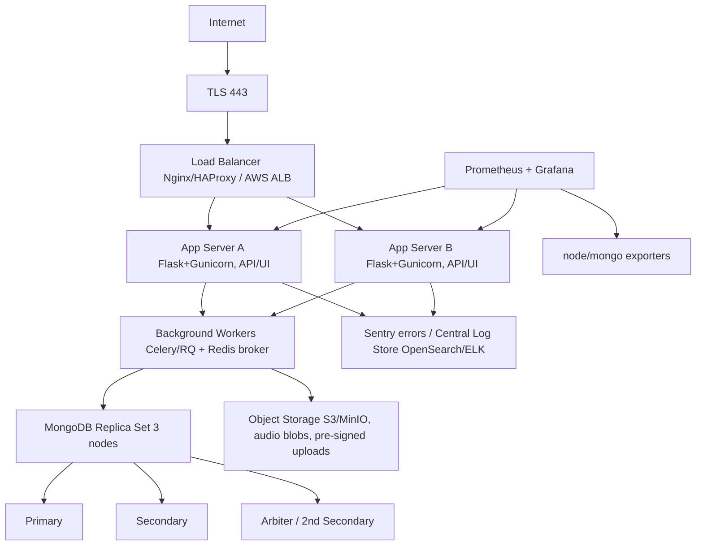

Got it — here’s a practical, copy-pasteable plan you can execute. I’ve split it into:
(1) reference architecture, (2) CI/CD pipeline (with YAML), and (3) key considerations & checklists. I’ve kept it VM/instance-based (no Kubernetes), since 300–500 active users + audio is comfortably handled with 2 app servers + 1 LB + Mongo replica set.

---

## 1) Reference deployment architecture

### Why this shape?
- Audio files are uploaded directly to object storage (S3/MinIO) via pre-signed URLs to keep app servers light and avoid timeouts; app writes only metadata to Mongo.
- Replica set (3 nodes) for durability + failover. Primary in same AZ as app; secondaries in different AZ (or at least different hosts).
- Background workers handle heavy audio processing asynchronously (Celery/RQ), triggered by job records in Mongo; results stored back to Mongo and/or S3.
- Sentry for centralized error tracking; ELK/OpenSearch (optional) for request logs; Prometheus/Grafana on the perf box for CPU, memory, disk I/O, HTTP latencies, and Mongo metrics.

### Minimal instance sizing (starting point)
- LB: 1 vCPU / 1–2 GB RAM.
- Each App server: 4 vCPU / 8–16 GB RAM; Gunicorn workers ≈ 2 * vCPU + 1 (e.g., 9 workers), --worker-class gthread, threads 2–4; enable keep-alive.
- Workers: 4 vCPU / 8–16 GB RAM (depends on audio model/codec).
- Mongo: 3 nodes, each 4 vCPU / 16–32 GB RAM, fast SSD (NVMe), IOPS-optimized.
- Object storage: Managed S3 or MinIO on 2+ disks (erasure coding) if self-hosted.
- Perf/Monitoring box: 2 vCPU / 4–8 GB RAM.

---

## 2) CI/CD: from Git push → tested → container image → deploy (blue/green)
Below is a GitHub Actions example that:
- runs lint/tests,
- builds a Docker image,
- scans (Trivy optional),
- pushes to a registry,
- deploys to your servers via SSH using blue/green with Nginx upstream switch.

### Assumes:
- Dockerfile at repo root
- Servers run Docker, each app server has /opt/app/current (green) and /opt/app/next (blue) compose stacks
- Nginx upstream points at either :8001 (green) or :8002 (blue)
- Secrets configured in GitHub: REGISTRY, REGISTRY_USERNAME, REGISTRY_PASSWORD, SSH_HOST_A, SSH_HOST_B, SSH_USER, SSH_KEY (private), SENTRY_DSN, etc.

```yaml
name: ci-cd
on:
  push:
    branches: [ "main" ]
  workflow_dispatch:
env:
  IMAGE_NAME: ${{ secrets.REGISTRY }}/yourorg/yourapp
  APP_PORT_GREEN: 8001
  APP_PORT_BLUE: 8002
jobs:
  test-build-push:
    runs-on: ubuntu-latest
    steps:
      - uses: actions/checkout@v4
      - name: Set up Python
        uses: actions/setup-python@v5
        with:
          python-version: "3.11"
      - name: Install deps
        run: |
          pip install -r requirements.txt
          pip install pytest flake8
      - name: Lint
        run: flake8 .
      - name: Test
        run: pytest -q
      - name: Log in to registry
        run: echo "${{ secrets.REGISTRY_PASSWORD }}" | docker login ${{ secrets.REGISTRY }} -u "${{ secrets.REGISTRY_USERNAME }}" --password-stdin
      - name: Build image
        run: |
          DOCKER_BUILDKIT=1 docker build \
          --build-arg SENTRY_DSN=${{ secrets.SENTRY_DSN }} \
          -t $IMAGE_NAME:${{ github.sha }} \
          -t $IMAGE_NAME:latest .
      - name: Push image
        run: |
          docker push $IMAGE_NAME:${{ github.sha }}
          docker push $IMAGE_NAME:latest
  deploy:
    needs: test-build-push
    runs-on: ubuntu-latest
    strategy:
      matrix:
        host: [ "${{ secrets.SSH_HOST_A }}", "${{ secrets.SSH_HOST_B }}" ]
    steps:
      - name: Prepare SSH
        uses: webfactory/ssh-agent@v0.9.0
        with:
          ssh-private-key: ${{ secrets.SSH_KEY }}
      - name: Deploy to app server
        run: |
          # deployment commands...
```

### Minimal Nginx upstream (on LB)
```nginx
upstream app_backend_green { server appA:8001; server appB:8001; }
upstream app_backend_blue { server appA:8002; server appB:8002; }
upstream app_backend { include /etc/nginx/conf.d/app_backend_green.conf; }
server {
    listen 443 ssl http2;
    server_name your.domain;
    location / {
        proxy_pass http://app_backend;
        proxy_set_header Host $host;
        proxy_set_header X-Forwarded-For $proxy_add_x_forwarded_for;
    }
    location = /healthz { return 200 "ok"; }
}
```

### Flask/Gunicorn essentials
- Add a /healthz route that returns 200 without DB access.
- Add Sentry:
```python
import sentry_sdk
from sentry_sdk.integrations.flask import FlaskIntegration
sentry_sdk.init(
    dsn=os.getenv("SENTRY_DSN"),
    integrations=[FlaskIntegration()],
    traces_sample_rate=0.1, # start low, increase later
    profiles_sample_rate=0.05
)
```

---

## 3) Key considerations & step-by-step checklists

### A) MongoDB (Replica Set) setup
1. Install mongod on 3 nodes with dedicated SSDs; enable wiredTiger, set vm.swappiness=1, filesystem xfs.
2. Bind to private NIC; enable TLS, SCRAM auth, IP allow-list.
3. Initialize replica set on PRIMARY:
```js
rs.initiate({
  _id: "rs0",
  members: [
    { _id: 0, host: "mongo1:27017", priority: 2 },
    { _id: 1, host: "mongo2:27017", priority: 1 },
    { _id: 2, host: "mongo3:27017", priority: 0, arbiterOnly: false }
  ]
})
```
4. Create app user with least-privilege; configure app URI using retryWrites=true&w=majority.
5. Backups:
   - MongoDB Atlas: enable continuous backups + Point-in-Time
   - Self-hosted: nightly mongodump + oplog; copy to offsite storage.
6. Observability: run mongodb_exporter and track opcounters, locks, wiredTiger cache, oplog window, replication lag.

### Schema & performance
- Store large audio as S3/MinIO objects; in Mongo store object keys + metadata.
- Create compound indexes for hot queries; use hint() in critical paths; set maxPoolSize (50–100) in driver.

### B) Audio upload & processing flow
- Client requests pre-signed PUT URL → uploads to object storage → API enqueues a job → workers process → write results.
- Enforce content-length limits, MIME type, optional ClamAV scan.
- Long processing: progress via WebSocket/SSE or polling endpoint.

### C) Centralized logging & error tracking
- Sentry for exceptions (backend + workers), tag by release (git SHA) and env.
- Ship logs via Fluent Bit → OpenSearch/ELK; keep PII out of logs.

### D) Monitoring (Perf box)
- Prometheus scraping: node_exporter, gunicorn_exporter, mongodb_exporter, nginx exporter.
- Grafana dashboards: latency, error rates, queue depth, worker throughput, Mongo wt cache hit, replication lag.
- Alerts: SLO burn rate, Mongo primary down, disk ≥80%, RAM ≥85%, queue depth spikes.

### E) Security & networking
- TLS everywhere
- Private subnets for DB/Redis/MinIO; only LB public.
- Secrets via environment or Vault
- Rate limits on LB for uploads; CORS only for allowed origins.

### F) Deployment strategy
- Blue/green or rolling: switch Nginx upstream after /healthz passes.
- DB migrations: idempotent “expand-and-contract” changes.

### G) Sizing & concurrency tips
- Gunicorn: start 9 workers × 2 threads; measure p95 latency → tune.
- Worker concurrency: CPU-heavy tasks; e.g., 4–8 per 4 vCPU box for CPU-bound audio.

### H) Environment layout
- prod, staging, dev with separate Mongo DBs, S3 buckets, Sentry projects, Grafana datasources.
- Use feature flags for risky changes.

### Quick to-do checklist
- Provision VMs: LB, AppA, AppB, Workers, Mongo(3), Perf box, MinIO (if self-hosted)
- Install Docker, docker-compose, Nginx/HAProxy, Redis
- Configure Mongo replica set (TLS, auth, backups, monitoring)
- Object storage bucket + IAM; pre-signed uploads
- Add /healthz, Sentry SDK, Prometheus /metrics
- Configure Fluent Bit → OpenSearch/ELK (optional)
- Set up Grafana dashboards & alerts
- Put Nginx upstream switch file in place; test blue/green swap
- Add GitHub Actions secrets; push to main → verify CI/CD
- Load test (k6/Locust): uploads + processing + DB write paths

---

Optional: GitHub Actions deploy step can be tailored to exact server hostnames and ports, or switched to GitHub → Ansible or GitHub → AWS (ALB + ASG + S3 + DocumentDB/Atlas).

