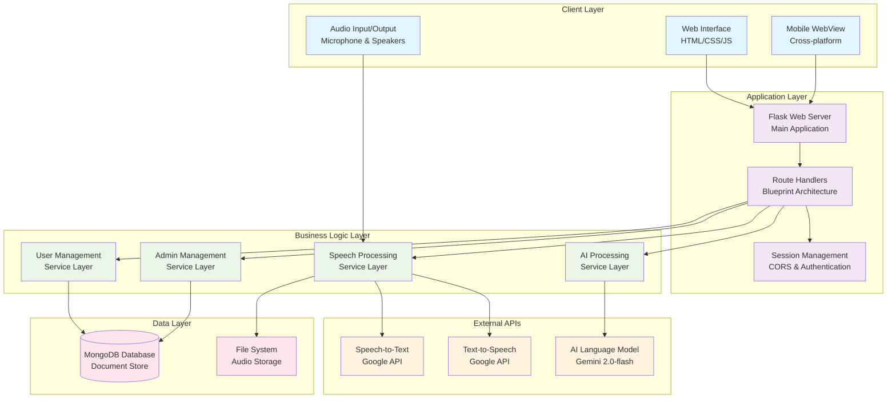
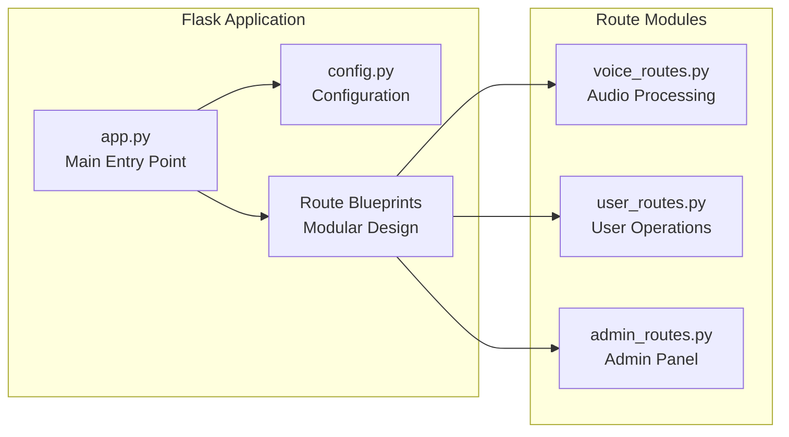
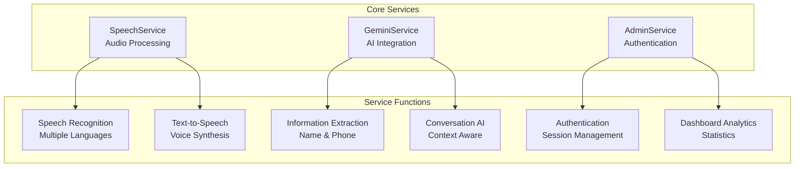
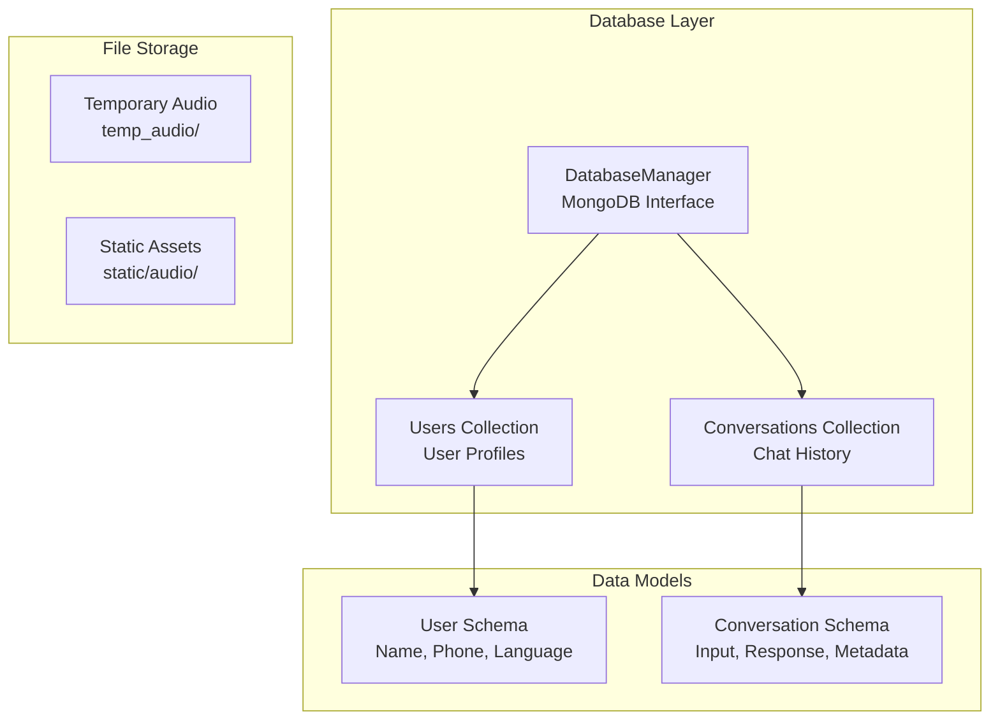
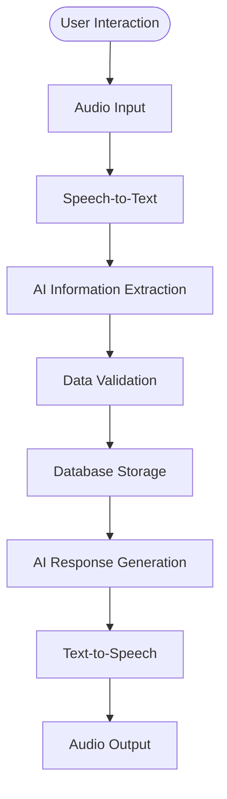
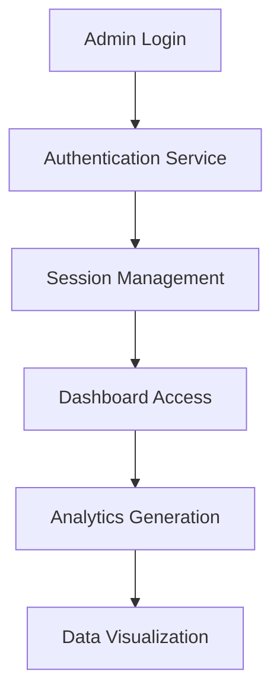
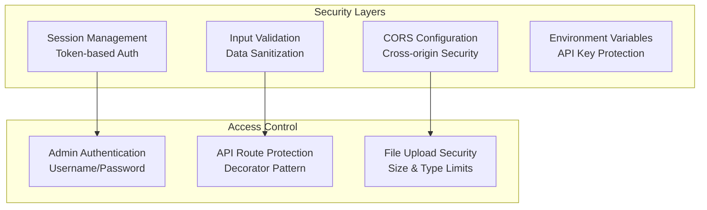
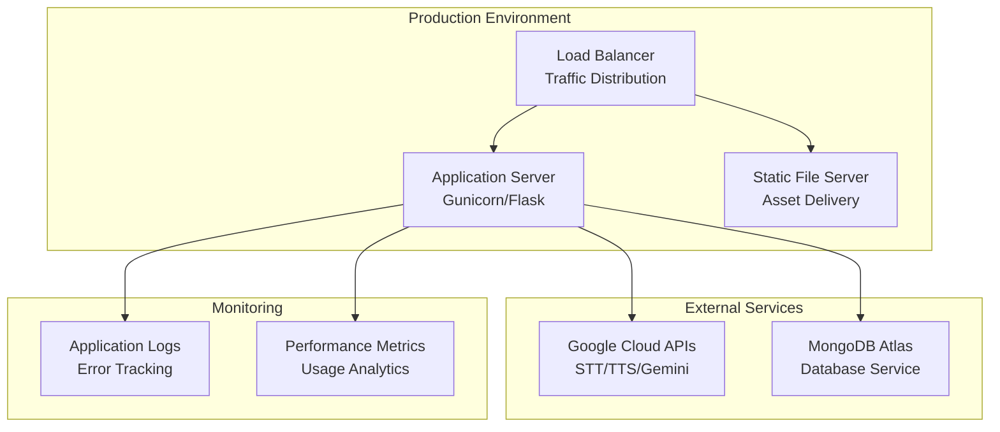

# High-Level System Architecture

## 🏗️ System Overview

## 🔧 Component Architecture

### 1. Application Core

### 2. Service Layer Architecture

### 3. Data Architecture

## 🌊 Data Flow Patterns

### 1. User Registration Flow

### 2. Admin Management Flow

## 🎯 Key Technology Stack

### Backend Technologies
- **Framework**: Flask (Python)
- **Database**: MongoDB (Document Store)
- **AI Services**: Google Gemini 2.0-flash
- **Speech Processing**: Google STT/TTS APIs
- **Authentication**: Session-based

### Frontend Technologies
- **Interface**: HTML5/CSS3/JavaScript
- **Audio API**: Web Audio API
- **State Management**: JavaScript Classes
- **AJAX Communication**: Fetch API

### External Integrations
- **Speech Recognition**: Google Cloud STT
- **Voice Synthesis**: Google Cloud TTS
- **AI Processing**: Google Gemini AI
- **Database**: MongoDB Atlas/Local

## 🔒 Security Architecture

## 📱 Deployment Architecture

## 🚀 Scalability Considerations

### Horizontal Scaling
- **Stateless Design**: Session storage in database
- **Load Balancing**: Multiple Flask instances
- **Database Sharding**: MongoDB scaling patterns
- **CDN Integration**: Static asset distribution

### Performance Optimization
- **Caching**: Audio file caching strategies
- **Connection Pooling**: Database connection management
- **Async Processing**: Background task handling
- **Resource Optimization**: Memory and CPU efficiency

---

*This architecture provides a comprehensive overview of the system design, component relationships, and technological foundations without revealing specific implementation details or business logic.*